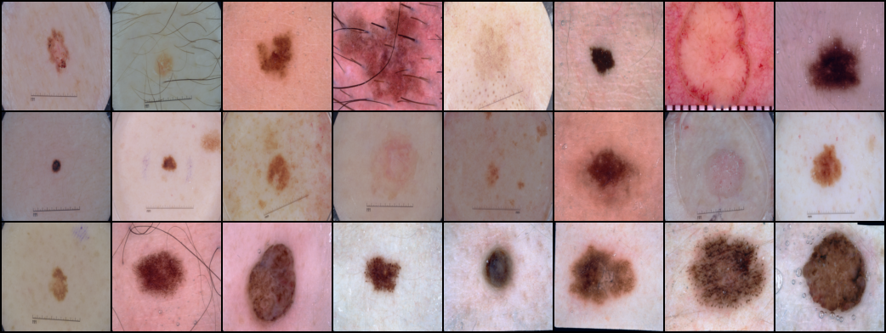
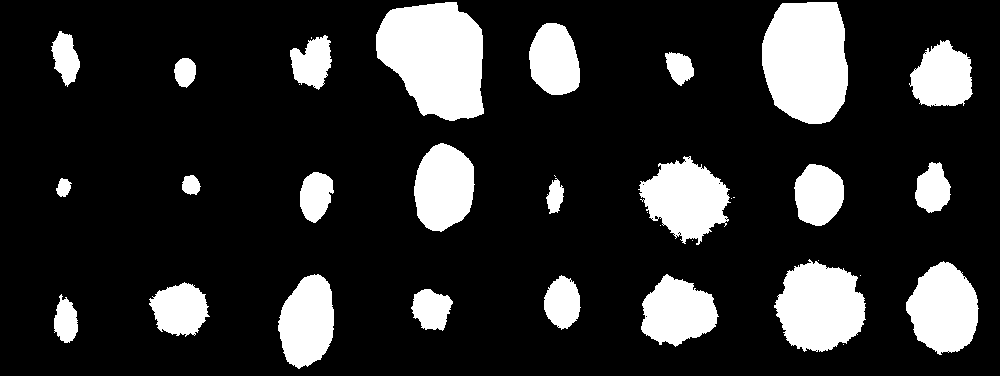
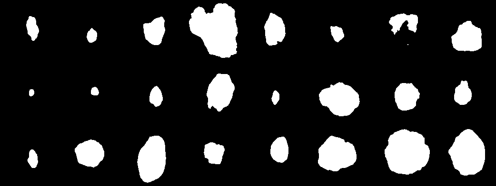

# 動作確認結果

2クラスのセグメンテーション (病気かそれ以外か). 多クラスの場合は追加実装が必要.

## 動作環境

- ubuntu 18.04, cuda 9.2, cudnn 7
  - Dockerfile
- pytorch 1.2.0+cu92
- torchvision 0.4.0+cu92
  - `pip install torch==1.2.0+cu92 torchvision==0.4.0+cu92 -f https://download.pytorch.org/whl/torch_stable.html`

## データセット

- Skin cancer : https://challenge.isic-archive.com/data#2017

```
# ディレクトリ
SegAN
├── train.py
├── ISIC-2017_Test_v2_Data
├── ISIC-2017_Test_v2_Part1_GroundTruth
├── ISIC-2017_Training_Data
└── ISIC-2017_Training_Part1_GroundTruth
```

## Training

- オリジナルの`train.py`の修正箇所
  - `124, 130, 146, 151 行目` : `squeeze関数`で`1の次元`を削除
  - `161, 162, 163 行目` : `.item()`に変更

- 実行 : `CUDA_VISIBLE_DEVICES=1 python train.py --cuda --batchSize 34`

- 実行ログ : `train.log`

## Result

ベストスコアは150epoch, 計算時間は4時間.

- `outputs_/input_val_epoch_150.png`

  

- `outputs_/label_val_epoch_150.png`

  

- `outputs_/result_val_epoch_150.png`

  

---
---

# SegAN: Semantic Segmentation with Adversarial Learning

Pytorch implementation for the basic ideas from the paper [SegAN: Adversarial Network with Multi-scale L1 Loss for Medical Image Segmentation](https://arxiv.org/pdf/1706.01805.pdf) by Yuan Xue, Tao Xu, Han Zhang, L. Rodney Long, Xiaolei Huang.

The data and architecture are mainly from the paper [Adversarial Learning with Multi-Scale Loss for Skin Lesion Segmentation](http://www.cse.lehigh.edu/~huang/ISBI_Paper2018.pdf) by Yuan Xue, Tao Xu, Xiaolei Huang.


### Dependencies
python 2.7

[Pytorch 1.2](http://pytorch.org/)


**Data**

- Download the dataset for [ISBI International Skin Imaging Collaboration (ISIC) 2017 challenge, Part I Lesion Segmentation](https://challenge.kitware.com/#challenge/n/ISIC_2017%3A_Skin_Lesion_Analysis_Towards_Melanoma_Detection) and save data folders under the same directory of the code.
- If you want to play with your own dataset, remember to change the folder name accordingly in the LoadData.py.


**Training**
- The steps to train a SegAN model on the ISIC skin lesion segmentation dataset.
  - Run with: CUDA_VISIBLE_DEVICES=X(your GPU id) python train.py --cuda.
  	You can change training hyperparameters as you wish, the default output folder is ~/outputs.
  	For now we only support training with one GPU.
  	The training images will be save in the ~/outputs folder.
  - The training code also includes the validation part, we will report validation results every 10 epochs, validation images will also be saved in the ~/outputs folder.
- If you want to try your own datasets, you can just do whatever preprocess you want for your data to make them have similar format as this skin lesion segmentation dataset and put them in a folder similar to ~/ISIC-2017_Training_Data. You can run the model directly for a natural image dataset; For 3D medical data such as brain MRI scans, you need to extract 2D slices from the original data first. If your dataset has more than one class of label, you can run multiple S1-1C models as we described in the [SegAN paper](https://arxiv.org/pdf/1706.01805.pdf).


### Citing SegAN
If you find SegAN useful in your research, please consider citing:

```
@article{xue2017segan,
  title={SegAN: Adversarial Network with Multi-scale $ L\_1 $ Loss for Medical Image Segmentation},
  author={Xue, Yuan and Xu, Tao and Zhang, Han and Long, Rodney and Huang, Xiaolei},
  journal={arXiv preprint arXiv:1706.01805},
  year={2017}
}
```


**References**

- Some of the code for Global Convolutional Block are borrowed from Zijun Deng's excellent [code](https://github.com/ZijunDeng/pytorch-semantic-segmentation)
- We thank the Pytorch team and some of our image prepocessing code are borrowed from the pytorch official examples
